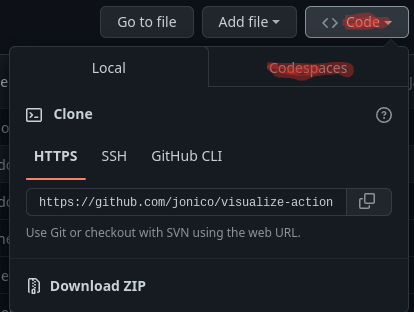

# awesome-linuxvm
(we are not a legitamite awesome-repo.)

-----

 - Step 1: Go to this link: <https://github.com/jonico/visualize-actions-matrix-builds-on-k8s>
 
Once you go to this link, click the Code Button, And then click the Codespaces button. Create the new codespace.



Create the Codespace.

Wait for it to load, then:
 - Step 2: Click Ports.
 - Step 3: Right click port 6080 and make it public.

Under local adress, click the globe icon on the port 6080, and for the password type "vscode".


Right click, go to System -> Edit Application Menu, and remove the first line (which is this one)
```
    [exec] (Start Matrix Visualization GUI) { tilix -e /bin/bash -il ./start-gui.sh } <>
```

Done! Enjoy your VM! you have 4gb of ram, so do whatever!

Here is a video guide, below.
<https://www.youtube.com/watch?v=VYTB-y5pA1Q> 
